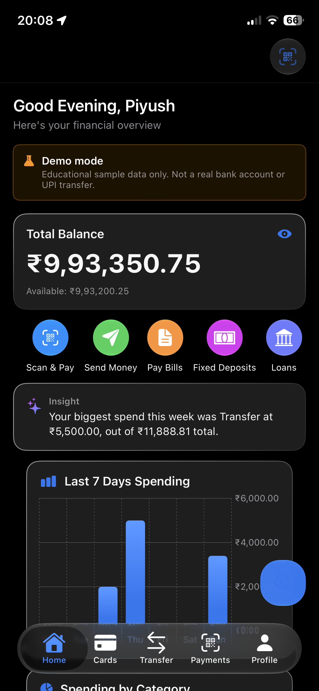
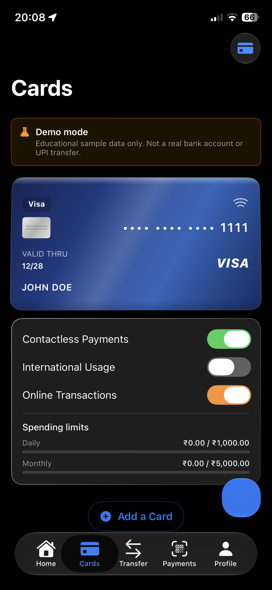
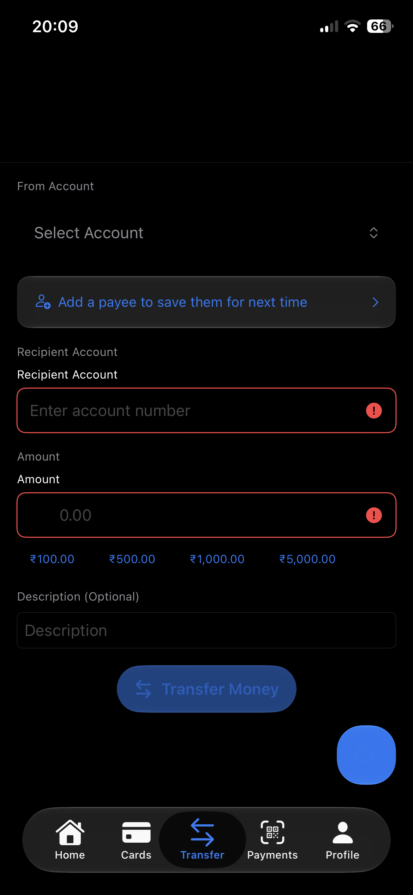
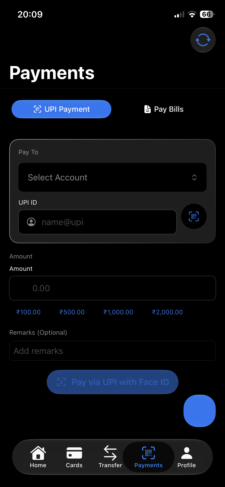
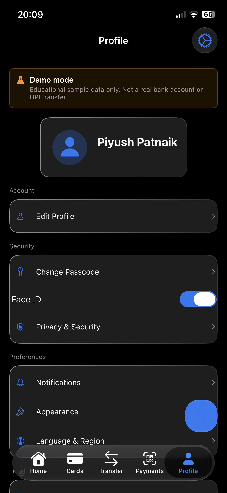
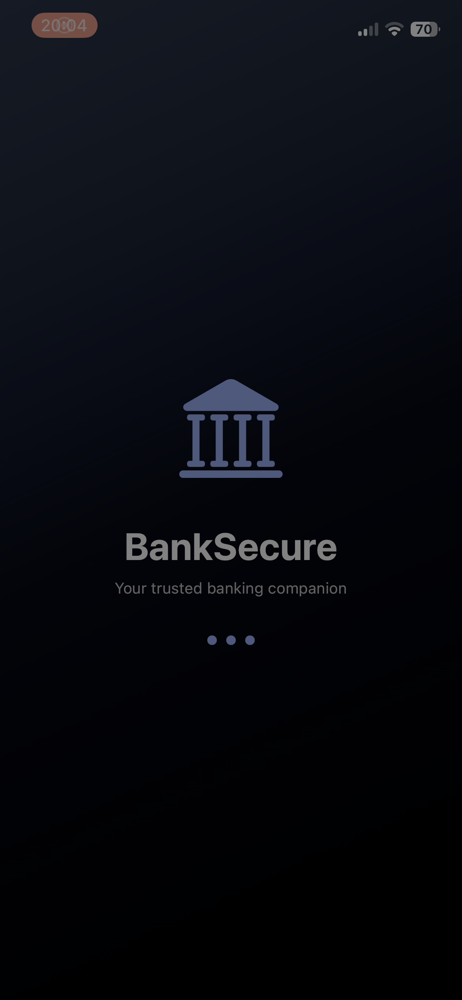
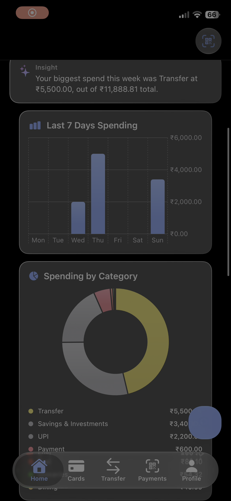

# BankSecure

[](#requirements)
[](#requirements)
[](#tech-stack)
[](#disclaimer)

An educational **mobile banking client** built with SwiftUI and SwiftData. Data lives on-device with no backend server, though it isn't fully offline — see the network note below. BankSecure demonstrates production-style architecture, security patterns, and polish for a consumer banking app — accounts, transfers, UPI-style payments, bill pay, cards, fixed deposits, loans, and an on-device AI assistant — without connecting to any real bank, card network, or payment rail.

> **This is a demo app.** It does not move real money, is not PCI-DSS certified, and is not affiliated with any financial institution. See [Disclaimer](#disclaimer).

---

## Screenshots

| Home | Cards | Sign In |
|---|---|---|
|  |  |  |

| Transfer | Notifications |
|---|---|
|  |  |

## Demo videos

Two screen recordings walking through the app's flows are included in [`docs/videos`](docs/videos). GitHub doesn't autoplay video inline in a README, so click a thumbnail below to open/download the clip.

[](docs/videos/demo-1.mov)
[](docs/videos/demo-2.mp4)

> **Repo size note:** these recordings are ~55 MB combined. That's under GitHub's 100 MB hard limit but well past its "large file" warning threshold. If you'd rather keep the repo lean, consider [Git LFS](https://git-lfs.com) for `docs/videos/`, or upload the clips to YouTube/an external host and link to them here instead.

---


## Table of contents

- [Screenshots](#screenshots)
- [Demo videos](#demo-videos)
- [Features](#features)
- [Tech stack](#tech-stack)
- [Project structure](#project-structure)
- [Requirements](#requirements)
- [Getting started](#getting-started)
- [CloudKit setup (optional)](#cloudkit-setup-optional)
- [Security model](#security-model)
- [Testing](#testing)
- [Disclaimer](#disclaimer)
- [License](#license)

---

## Features

| Area | Details |
|---|---|
| **Onboarding & Auth** | Guided onboarding, 4-digit passcode (Keychain-hashed), Face ID / Touch ID, lockout after repeated failures, background + inactivity auto-lock |
| **Home** | Balance overview with hide/show toggle, spending charts, quick actions, AI-generated spending insight, persistent demo-mode banner |
| **Transfers & Payments** | Internal transfers, UPI-style payments, bill pay — all backed by real local balance updates and transaction records |
| **Cards** | Card management with masked (last-4) numbers, live daily/monthly spend vs. limit tracking |
| **Fixed Deposits & Loans** | FD creation with rate cards, loan tracking with an amortization calculator |
| **Beneficiaries & Billers** | Add/manage payees and billers, IFSC lookup for bank transfers |
| **AI Assistant** | On-device chatbot for account insights and support (Apple Intelligence / Foundation Models where available, with graceful fallback) |
| **Siri & Spotlight** | App Intents for quick actions and Spotlight search integration |
| **Settings** | Appearance, language & region, notifications, privacy & security — all backed by persisted `AppSettings` |
| **Sync** | Optional private CloudKit sync across a user's own devices — no shared or public data |

## Tech stack

- **SwiftUI** — declarative UI across all screens
- **SwiftData** — local persistence for accounts, transactions, cards, beneficiaries, billers, FDs, and loans
- **CloudKit (private database, optional)** — per-user sync only; no backend server involved
- **Keychain Services** — passcode hash, salt, and session token storage
- **App Intents** — Siri shortcuts and Spotlight indexing
- **Foundation Models / Apple Intelligence** — on-device AI assistant, with fallback for unsupported devices/OS versions

No analytics or ad SDKs are included, and there is no backend server in this repository. The one exception is `IFSCLookupService`, which calls a free public third-party API (Razorpay's IFSC directory) to resolve bank branch details — see [What this app is not](Banking%20Application/README.md) for exactly what it sends.

## Project structure

```
Banking Application/
├── Banking Application.xcodeproj/     # Xcode project
├── Banking Application/               # App target
│   ├── BankApp.swift                  # Entry point — onboarding → passcode → login → tabs
│   ├── Banking Application.entitlements
│   ├── Models/                        # SwiftData models (Account, Transaction, Card, Loan, …)
│   ├── ViewModels/                    # MVVM state (Account, Transfer, BillPay, FixedDeposit, Loan, …)
│   ├── Views/                         # SwiftUI screens
│   │   ├── Components/                # Reusable UI components
│   │   └── DesignSystem/              # Shared styling, typography, GlassCard, etc.
│   ├── Services/                      # Auth, Keychain, Crypto, Persistence, Settings, AI chatbot
│   ├── Managers/                      # Spotlight indexing, etc.
│   ├── Intents/                       # Siri / App Intents
│   ├── Utilities/                     # Currency formatting (INR), helpers
│   └── Assets.xcassets/               # App icon, colors, images
└── Banking ApplicationTests/           # XCTest unit tests (separate target)
```

## Requirements

- **Xcode 26** or later
- **iOS 26+** target device or simulator (the project's `IPHONEOS_DEPLOYMENT_TARGET` is 26.0; earlier-OS Material-style fallback code exists in a few places like `LiquidGlass.swift` and `AIChatbotService` but is currently unreachable at this deployment target — lower it only after confirming those paths still build and behave correctly)
- An Apple Developer account **only if** you plan to enable CloudKit sync

## Getting started

1. Clone the repository and open `Banking Application.xcodeproj` in Xcode.
2. Select a simulator or a physical device as the run destination.
3. Build and run (`⌘R`).
4. On first launch: complete onboarding → create a passcode → demo data (sample accounts, transactions, cards, and billers) is seeded automatically.
5. A **Demo Mode** banner is shown throughout the app to make clear that no real financial data is involved.

No environment variables, API keys, or backend setup are required to run the app locally.

## CloudKit setup (optional)

CloudKit sync is **off by default in practice** unless you configure your own container — the bundled entitlements reference a placeholder container ID and will not sync until you do the following:

1. In Xcode, select the app target → **Signing & Capabilities**.
2. Under the **iCloud** capability, replace the placeholder container (`iCloud.com.banksecure.app`) with a container scoped to your own Apple Developer team.
3. Ensure **CloudKit** is checked under iCloud services.
4. Build and run signed in with a real iCloud account (a simulator without an iCloud account will fall back to local-only storage automatically rather than crashing).

Only the signed-in user's own private CloudKit database is used — there is no shared or public database, and no other user's data is ever accessible.

## Security model

BankSecure follows realistic mobile banking security patterns, scoped appropriately for a demo:

- **Passcode** — 4-digit passcode, salted SHA-256 in the Keychain (`WhenUnlockedThisDeviceOnly`). SHA-256 is not a stretching KDF; brute-force resistance comes from exponential lockout in `AuthenticationService`, not from the hash.
- **Biometrics** — optional Face ID / Touch ID, user-toggleable
- **Session handling** — background lock and inactivity timeout, governed by the "App Passcode Lock" setting
- **Lockout** — failed passcode attempts trigger a temporary lockout
- **Card data** — only the last four digits of a card number are ever stored; the CVV field is marked `@Transient` and is never persisted
- **Minimal network surface** — no general-purpose HTTP client and no backend; the only outbound call is `IFSCLookupService`'s IFSC-code lookup against a public third-party API (see Tech stack above). Everything else, including banking data, never leaves the device except via the user's own private CloudKit sync.

This is a portfolio/architecture demonstration, **not** a PCI-DSS or SOC 2 certified system, and should not be used to store real card numbers, CVVs, or banking credentials.

## Testing

Unit tests live in the separate `Banking ApplicationTests/` target (kept out of the app target so XCTest is never linked into the shipped binary):

| Test file | Coverage |
|---|---|
| `CryptoServiceTests` | Passcode hashing and constant-time comparison |
| `CardModelTests` | Card number normalization (last-4) and spend/limit progress |
| `CurrencyFormatterTests` | INR currency formatting |
| `TransferValidationTests` | Transfer form validation logic |

**To run tests in Xcode:**

1. **File → New → Target → Unit Testing Bundle**, name it `Banking ApplicationTests` if not already configured.
2. Add the test files from `Banking ApplicationTests/` to that target.
3. Ensure each test file uses `@testable import Banking_Application`.
4. **Product → Test** (`⌘U`).

## Disclaimer

BankSecure is built for **learning, portfolio demonstration, and UI/architecture experimentation only**.

- It is **not** a licensed bank, e-money, or payments product.
- It is **not** connected to any core banking system, UPI/NPCI network, or card scheme.
- It does **not** move, hold, or transmit real money.
- Do **not** enter real banking credentials, real card numbers, or any real personal financial data into this app.

## License

Add your preferred license here (e.g. MIT) before making this repository public.
